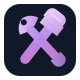

<div align="center">
  
  <br/>
  
  <br/><br/>
  
  
  
  
</div>

---

## 👋 About Me

I'm Gokul — Founder of GKFXL, Full Stack Developer, AI Engineer, startup builder, and Agricultural Engineering student from Coimbatore, Tamil Nadu, India.

I build technology across:

- 🤖 Artificial Intelligence
- 🌐 Full-Stack Web Applications
- 📦 SaaS Platforms
- 📱 Mobile Applications
- 🧠 AI-powered Products
- 🗄️ Database Systems
- ☁️ Cloud Applications
- ⚙️ Automation
- 🌾 Smart Agriculture
- 🤖 Robotics & IoT
- 🛠️ Developer Tools
- 🚀 Startup MVPs

> Find a real problem → understand it → design the system → build it → test it → deploy it → improve it.

I enjoy taking an idea from concept → architecture → implementation → product.

---

## 🏢 GKFXL

GKFXL is my long-term technology ecosystem and startup vision.

**AI + Software + Automation + Agriculture + Education + Business**

**Vision:** Build useful technology from India for people everywhere.

**Mission:** Build practical, scalable and intelligent software systems that help students, developers, startups, businesses, farmers, rural communities, and technology teams.

---

## 🚀 Featured Projects

### 🏢 GKFXL
Startup & Technology Ecosystem

- Founder Dashboard
- Productivity Systems
- Team Management
- Business Systems
- Analytics
- Learning
- AI Tools

**Stack:** Next.js • TypeScript • Supabase • PostgreSQL

### 🌾 FarmPlug AI
**Your Farm's Plug to Every Market.**

AI-powered agricultural market intelligence connecting:

**Farmers / FPOs ↔ Buyers / Processors / Exporters**

- 📈 Demand forecasting
- 💰 Price discovery
- 🌱 Production decisions
- 🛒 Buyer matching
- 📦 Bulk aggregation
- 🚚 Route optimization
- 📊 Market intelligence
- 🤝 Stronger market linkages

**Stack:** Next.js • TypeScript • AI • Supabase

### 🤖 AgriBot AI
Intelligent agriculture robotics platform for:

- 🌱 Soil monitoring
- 💧 Irrigation automation
- 📍 GPS field positioning
- 📷 Crop observation
- 🚧 Obstacle detection
- 🤖 Robotic movement
- 📊 Sensor monitoring
- ☁️ Cloud-connected robot control

**Hardware:** ESP32 • ESP32-CAM • Sensors • GPS • Motors • Robotics  
**Software:** Next.js • TypeScript • Supabase • IoT

### 👕 DRYNN
Premium streetwear and custom apparel platform.

**Stack:** Next.js • Supabase • Cloudinary

### 🛒 Santro
Multi-vendor marketplace concept connecting:

**Customers → Shops → Delivery Partners**

Focus: authentication, products, orders, payments, logistics, vendor management.

**Stack:** Next.js • Supabase • PostgreSQL

### 🧠 GGE
AI-powered guidance platform focused on education, career guidance, learning resources, government information, practical solutions, and rural communities.

**Stack:** Next.js • AI • Tailwind CSS

---

## 🧠 What I Build

<div align="center"></div>

---

<div align="center">
  
  <h2>Languages and Tools</h2>
  <p><em>Web • Mobile • AI • Systems • Databases • Automation • Cloud • IoT • Robotics</em></p>
</div>

### 🔹 Popular General-Purpose Languages

Python • Java • C • C++ • C# • JavaScript • TypeScript • Go (Golang) • Rust • Kotlin • Swift • Dart • Ruby • PHP • R • MATLAB • Scala • Perl • Lua • Objective-C

### 🌐 Web Development

HTML • CSS • JavaScript • TypeScript • PHP • Python • Ruby • Go • Rust

**Focus:** Frontend • Backend • Full Stack • APIs • SaaS • Web Applications • Authentication • Databases

### 📱 Mobile Development

| Language | Ecosystem |
|---|---|
| Dart | Flutter |
| Kotlin | Android |
| Swift | iOS |
| Java | Android |
| C# | .NET / .NET MAUI |

### 🤖 AI / Data Science

Python • R • Julia • MATLAB • C++ • Rust

**Focus:** Artificial Intelligence • Machine Learning • LLM Applications • RAG • Embeddings • Data Processing • Automation • Intelligent Applications • AI APIs

### ⚙️ Systems / High Performance

C • C++ • Rust • Go • Zig • Assembly

**Focus:** Systems Programming • Performance • Embedded Systems • Robotics • Low-Level Computing

### 🗄️ Database / Query Languages

SQL • PL/SQL • T-SQL • GraphQL

**Focus:** PostgreSQL • Supabase • Data Modeling • Database Architecture • APIs • Query Design

### 🖥️ Scripting / Automation

Bash / Shell • PowerShell • Python • JavaScript • Perl • Ruby

**Focus:** Automation • Developer Tooling • CI/CD • System Administration • Workflow Automation

### 🎮 Game Development

C++ • C# • GDScript • Lua • JavaScript / TypeScript

**Focus:** Game Logic • Interactive Systems • Simulation • Prototyping • Game Tools

---

## 🧩 Technology Matrix

| Domain | Technology Coverage |
|---|---|
| 🌐 Web | HTML • CSS • JavaScript • TypeScript • React • Next.js |
| 📱 Mobile | Dart • Flutter • Kotlin • Swift • Java • C# |
| 🤖 AI / Data | Python • R • Julia • MATLAB • C++ • Rust |
| ⚙️ Systems | C • C++ • Rust • Go • Zig • Assembly |
| 🗄️ Database | SQL • PL/SQL • T-SQL • GraphQL • PostgreSQL |
| 🖥️ Automation | Bash • Shell • PowerShell • Python • JavaScript |
| 🎮 Game | C++ • C# • GDScript • Lua • JavaScript • TypeScript |
| 🌾 AgriTech | Python • C/C++ • ESP32 • IoT • Sensors • Robotics |
| ☁️ Cloud | Docker • GitHub • Vercel • Supabase • Linux |
| 🧠 AI Engineering | LLMs • RAG • AI APIs • Embeddings • Automation |

### 🥇 Primary Engineering Stack
TypeScript • JavaScript • Python • Next.js • React • Supabase • PostgreSQL

### 🥈 Active Engineering Areas
AI Engineering • RAG • REST APIs • Docker • GitHub Actions • Cloud • IoT • Robotics • Smart Agriculture

### 🥉 Expanding Technology Coverage
C • C++ • Java • C# • Go • Rust • Kotlin • Swift • Dart • R • MATLAB • Julia • PHP • Ruby • Lua • Scala • Perl • Zig • Assembly

> Technology coverage represents learning, experimentation, project exposure, and expanding engineering capability. It does not imply equal professional proficiency across every language.

---

## 🏗️ Full-Stack Engineering

**Frontend:** React • Next.js • TypeScript • JavaScript • HTML • CSS • Tailwind CSS  
**Backend:** Node.js • Express.js • Next.js API Routes • REST APIs  
**Database:** PostgreSQL • Supabase • SQL • Firebase  
**Authentication:** Supabase Auth • Session Management • Role-Based Access  
**APIs:** REST • GraphQL • AI APIs • Third-Party Integrations

---

## 🤖 AI Engineering

My AI interests include LLM applications, AI assistants, Retrieval-Augmented Generation, embeddings, AI APIs, prompt engineering, AI automation, intelligent workflows, multimodal AI, AI-powered SaaS, local AI, AI agents, and data-driven decision systems.

**AI Stack:** Python • TypeScript • OpenAI • Groq • LangChain • Hugging Face • RAG • Embeddings

---

## 🗄️ Database Engineering

**Technologies:** PostgreSQL • Supabase • SQL • Firebase

**Focus:** Data modeling • Relational architecture • Authentication • API integration • Query design • Data validation • Application state • Realtime systems • Storage

---

## ☁️ Cloud & DevOps

Git • GitHub • GitHub Actions • Docker • Linux • Vercel • Render • Railway • Supabase

**Focus:** CI/CD • Deployment • Environment management • Cloud applications • Build pipelines • Production workflows • Repository management

---

## 🔐 Security Mindset

Security is considered throughout the development lifecycle.

- Environment variables
- Secret protection
- Authentication
- Authorization
- Input validation
- API security
- Database security
- Dependency awareness
- Secure Git workflows

**Never commit secrets.**

---

## 🌾 AgriTech & Smart Agriculture

My Agricultural Engineering background gives me a unique intersection:

**Agriculture + Software + AI + IoT + Robotics**

Areas of interest:

- Smart farming
- Precision agriculture
- Crop monitoring
- Soil intelligence
- Irrigation automation
- Agricultural robotics
- Market intelligence
- Farmer decision support
- Rural technology
- Agricultural AI

My goal is to use engineering to solve practical agricultural problems rather than build technology only for technology's sake.

---

## 🧠 Product Engineering

I enjoy working through the complete product lifecycle:

```text
💡 Idea → 🔎 Research → 🎯 Problem Definition → 🧠 Architecture → 🎨 Product Design
→ 💻 Development → 🧪 Testing → 🔐 Security → 🚀 Deployment → 📊 Measurement → 🔄 Iteration
```

---

## 🚀 Startup Builder Mindset

I don't want to only write code.

**Problem → User → Product → Technology → Business → Distribution → Growth**

This means thinking about product-market fit, user experience, business models, MVP development, automation, scalability, customer value, and long-term product strategy.

---

## 📊 GitHub Activity

<div align="center">
  <br/><br/>
  <br/><br/>
  
</div>

---

## 🐍 Contribution Journey

<div align="center"></div>

---

## 🏆 GitHub Achievements

<div align="center"></div>

---

## 📈 Engineering Growth

Web Development → Full-Stack Engineering → AI Engineering → Cloud Architecture → Systems Engineering → IoT & Robotics → Smart Agriculture → Product Engineering → Startup Building

---

## 📚 Currently Learning

- Advanced Next.js
- AI Engineering
- LLM Applications
- RAG
- System Design
- Cloud Architecture
- PostgreSQL
- Docker
- Kubernetes
- DevOps
- Machine Learning
- Automation
- Robotics
- Agricultural Technology

---

## 🔬 Research Interests

AI for agriculture • AI agents • Autonomous systems • Agricultural robotics • Rural technology • Intelligent marketplaces • Decision-support systems • AI-powered education • Local AI • Developer productivity • Automation • Cloud architecture • Human-AI collaboration

---

## 🌍 Building in Public

**Learning → Experimenting → Failing → Debugging → Improving → Sharing**

I enjoy documenting projects, experimenting with new technologies, and continuously improving my engineering workflow.

---

## 🇮🇳 India → 🌍 Global

<div align="center"></div>

My long-term goal is to create products from India that can solve problems globally while remaining deeply connected to real-world needs.

---

## 🧭 My Engineering Principles

**01 — Build:** Ideas become valuable when they become real products.  
**02 — Learn:** Every project is an opportunity to learn something new.  
**03 — Experiment:** Prototypes create understanding faster than assumptions.  
**04 — Validate:** Build based on real problems and real feedback.  
**05 — Secure:** Security should be part of engineering, not an afterthought.  
**06 — Ship:** A useful product in production is better than an unfinished perfect idea.  
**07 — Improve:** Every release should create an opportunity for the next iteration.

---

## 💡 What I Can Build

AI-powered web applications • SaaS platforms • Dashboards • AI assistants • RAG systems • Developer tools • Marketplaces • Authentication systems • REST APIs • Database-backed applications • Mobile applications • Automation systems • IoT applications • Agricultural technology • Robotics prototypes • Startup MVPs • Internal business tools

---

## 🤝 Collaboration

I'm interested in collaborating on AI projects, open-source projects, SaaS products, AgriTech, developer tools, automation, robotics, startup ideas, research projects, and student technology projects.

---

## 🎯 Long-Term Vision

My long-term goal is to become a world-class software and AI engineer while building technology companies and products that create measurable real-world value.

**The bigger goal:** Use engineering, AI and entrepreneurship to build technology that improves people's lives.

---

## ⚡ Personal Motto

<div align="center"></div>

---

## 📫 Connect With Me

<div align="center">
  
  <br/><br/>
  Coimbatore, Tamil Nadu, India 🇮🇳
  <br/><br/>
  Founder • Developer • AI Engineer • Builder
</div>

---

<div align="center">
  
  <br/>
  
  <br/><br/>
  
</div>
